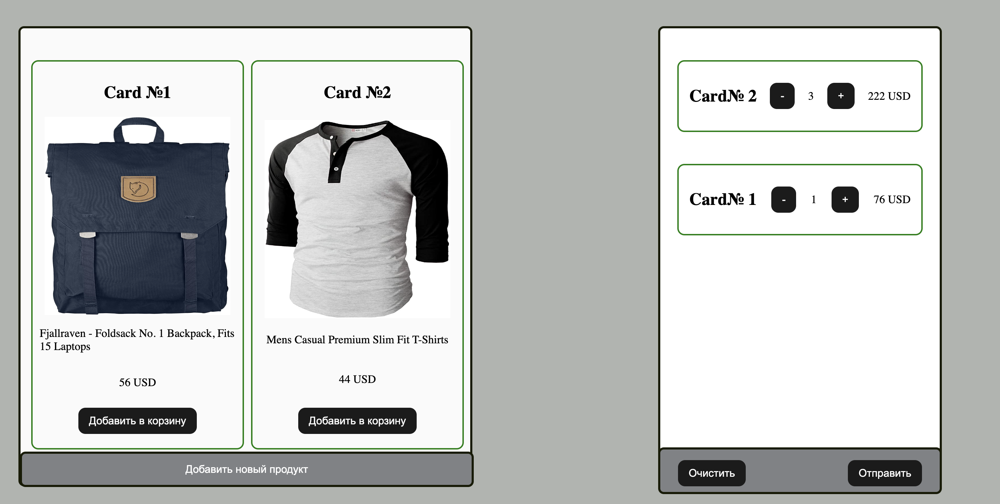
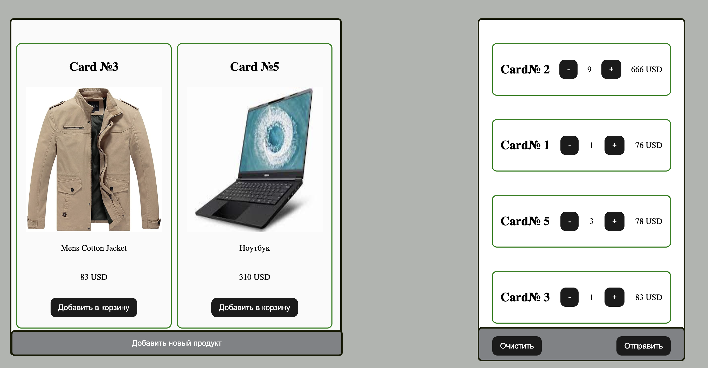

# Интернет Магазин

Посмотреть проект можно по ссылке https://igorgap.github.io/Project_Market_JS/

 

Вы можете выбрать продукт из каталога и добавить его в корзину, выбрав нужное количесво, вы увидите общую сумму

Если захотите дополнить продукт в магазин, то это легко сделать, нажав на кнопку "Добавить новый продукт" Всплывет модальное окно, где нужно заполнить все поля. Далее этот продукт появится в магазине и его можно добавлять в корзину

Если вы случайно вышли из магазина, ничего страшного, все сохраниться и вам не нужно снова добавлять продукты в корзину

<p
